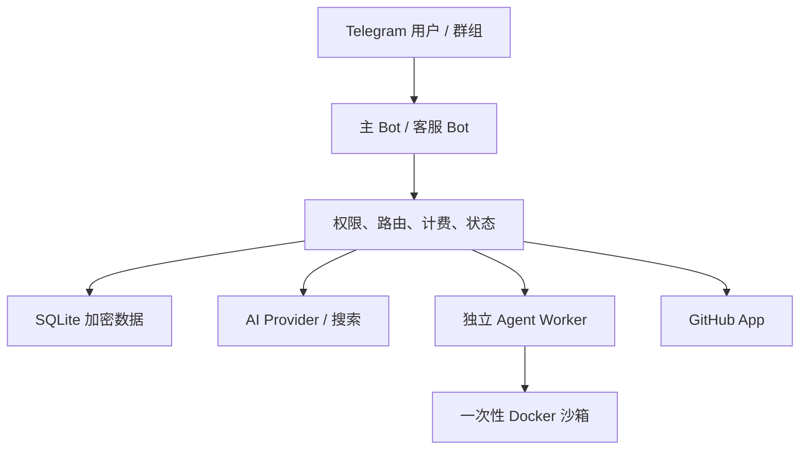

# Telegram-AI-Bot-Pro 项目完整说明

## 1. 项目是什么

Telegram-AI-Bot-Pro 是一个面向公开用户的多 Provider Telegram AI Bot。Telegram 是主要操作界面，SQLite 保存用户设置、会话、额度、支付、审计和 Agent 任务；模型平台只负责生成或工具决策，不直接获得 Bot 主机权限。

项目目标不是单次聊天 Demo，而是同时处理：

- 多平台 AI 聊天、模型选择、故障切换与任务路由
- 图片、文档、语音、翻译、搜索和工具调用
- Telegram 原生按钮、Rich Message、流式回复和停止生成
- 用户独立状态、每日免费额度、Stars 商品和真实成本结算
- 独立客服 Bot 与私聊工单
- Mini App 管理、用户设置、记录和余额
- 群组触发、欢迎消息和隐私入口
- GitHub App 授权、持久 Agent 任务和独立 Docker Worker
- 数据加密、日志脱敏、访问控制和部署诊断

## 2. 当前实现状态

| 模块 | 状态 | 说明 |
| --- | --- | --- |
| 主 Bot 私聊与群聊 | IMPLEMENTED | 私聊直接使用；群聊按触发规则处理 |
| 多 Provider | IMPLEMENTED | Gemini、Gemini Live、Groq、OpenRouter、GitHub Models、Hugging Face、Mistral、OpenAI、Anthropic、DeepSeek、Qwen、Grok、GLM、Doubao、OpenAI-compatible |
| Smart 任务路由 | IMPLEMENTED | 通用、翻译、代码、推理、长上下文、文档、视觉、OCR、工具、低成本十类目标 |
| Provider 故障切换 | IMPLEMENTED | 同平台备用模型、跨平台顺序、重试、冷却和用户自动模式 |
| 流式与 Rich Message | IMPLEMENTED | 私聊持续编辑同一持久消息；停止按钮按用户和请求隔离；格式失败自动降级 |
| Telegram 10.3 能力 | IMPLEMENTED | Rich/彩色按钮、disabled、compact table、expandable quotation、force reply、ephemeral 编辑与 Community 事件过滤均有能力检测和回退 |
| Telegram 10.3 手机实机 | BLOCKED | 自动化测试不能代替真实 iOS/Android Telegram 和生产 Bot API 实测 |
| 图片理解、图片生成、文档 | IMPLEMENTED | 实际可用性取决于所选 Provider、模型和额度 |
| 语音转写与 TTS | IMPLEMENTED | 需要对应 Provider 和兼容模型 |
| 双向 Live 语音 | PARTIAL | 连接与配置路径已实现；仍依赖 Google 官方 Live 模型、账号权限与真实客户端验证 |
| 视频模型处理 | NOT IMPLEMENTED | 视频额度强制为 0，不能出售或扣除 |
| 网页搜索与读取 | IMPLEMENTED | 搜索支持 Key 与免密回退；URL 读取有 SSRF、重定向、大小和超时保护 |
| 长期记忆 | IMPLEMENTED | 摘要、敏感信息阻断、加密存储和保留期清理 |
| 临时隐私聊天 | IMPLEMENTED | 单轮或临时上下文只保存在进程内，不写普通历史和长期记忆 |
| Stars 支付与退款 | IMPLEMENTED | 发票、预结账校验、幂等到账、六类余额、预留/结算/退回、退款租约与审计 |
| 付费模型成本结算 | IMPLEMENTED | Zeabur/LiteLLM 响应头、OpenRouter/兼容 usage 成本归一化；未知成本安全关闭或按冻结上限结算 |
| 客服 Bot | IMPLEMENTED | 只允许私聊；普通可复制消息用 `copyMessage` 转发；工单、接单、回复、关闭和自动关闭 |
| 群欢迎和购买隐私 | IMPLEMENTED | 优先使用只对目标用户可见的 Telegram 能力，失败直接跳主 Bot 私聊，不公开套餐和余额 |
| Mini App | IMPLEMENTED | 用户模型、设置、历史、余额与管理员视图；用户原文默认不返回 |
| 用户状态隔离 | IMPLEMENTED | 模型选择、流式任务、停止、统计、额度、订单和 Agent 任务均按 Telegram 用户 ID 隔离 |
| GitHub App | IMPLEMENTED | OAuth state 防重放、加密 Token、刷新、仓库权限和断开连接 |
| Agent 任务服务 | IMPLEMENTED | 持久状态、事件、暂停、继续、取消、预算与敏感操作审批 |
| 独立 Agent Worker | IMPLEMENTED | HMAC 接口、命令白名单、路径检查和一次性 Docker 沙箱代码已实现 |
| Agent 生产端到端 | BLOCKED | 需要独立 VPS、Docker daemon、HTTPS、真实 GitHub App 和付费模型完成实机验证 |

## 3. 系统结构

主要边界：

- Telegram Bot：接收更新、显示按钮、编辑流式消息和进行用户交互。
- 应用核心：判断用户、群组、权限、模型、免费/付费规则和工具调用。
- SQLite：保存必须跨重启保留的状态。
- Provider：只接收当前请求所需上下文，不拥有数据库或服务器权限。
- Worker：与 Bot 分开部署，只接收签名任务，并在临时容器里执行白名单命令。
- GitHub App：每个用户授权自己的仓库，不共用管理员私人 Token。

## 4. 一条普通 AI 消息怎么运行

1. Telegram 更新进入主 Bot，先确定 chat、user 和 update 类型。
2. 群聊先执行群组触发和隐私规则；不符合触发条件时停止。
3. 按 Telegram 用户 ID 读取该用户自己的语言、Provider、模型、模式和额度。
4. 判断任务类型；用户手动选择优先，之后才是专用能力、Smart 路由和默认模型。
5. 付费或未知价格模型在发出请求前冻结额度；免费模型使用对应每日免费额度。
6. Provider 返回流式片段时，私聊编辑同一条持久消息。停止生成只中止该用户对应请求。
7. Rich Message、HTML 或引用参数失败时，按同一消息链降级，不额外重复发送答案。
8. 记录 Provider 调用、token、实际成本和结算结果；归还未使用的冻结额度。
9. 在允许保存时更新加密对话历史；长期记忆先经过敏感信息检测。

## 5. 免费额度、已购余额与真实成本

项目把六类额度分开保存：

- `chat`：普通聊天和付费文本模型
- `vision`：图片理解
- `image_generation`：图片生成
- `tts`：文字转语音
- `live_voice`：当前用于语音转写
- `video`：预留字段，当前不可出售和消费

免费用户并不是可以调用所有模型。模型收费分类采用“未知即付费”：

1. `PAID_PROVIDER_PATTERNS` 命中时整个平台按付费。
2. `PAID_MODEL_PATTERNS` 或目录明确付费时按付费。
3. 明确免费模型或免费 Provider 才可使用每日免费额度。
4. 没有价格信息的模型按付费处理。

付费调用先按 `BILLING_MAX_REQUEST_USD` 冻结余额。平台返回可靠费用后，按真实美元成本乘 `BILLING_COST_MARKUP` 换算额度；没有可靠费用字段时按冻结上限扣除，避免 Bot 经营者替用户承担未知成本。

`STARS_PRODUCTS_JSON` 是套餐标题、价格和赠送额度的唯一来源。主 Bot、Mini App 和管理员页面读取同一份配置，不应在页面里另写一套套餐数字。

## 6. Telegram 输出与隐私设计

### 私聊流式

默认 `ENABLE_NATIVE_DRAFT_STREAMING=false`。Bot 发送一条持久消息，之后只编辑它；完成时仍是同一个 `message_id`。这样避免同时出现“上方流式回答、下方再次回复、过后草稿消失”。

Telegram 原生临时草稿仍可显式开启，但它本身会消失，完成后需要另一条持久消息，因此不作为生产默认。

### 原生格式和引用

用户发来的加粗、斜体、引用等 Telegram entities 会按文本内容进入请求，不会因为原生格式直接报错。Bot 发送端会尝试 Rich Message 或 HTML；实体、引用或新接口不被 Telegram 接受时自动降级为普通文本或无引用回复。

### 群组隐私

- 主 Bot 的 `/help`、`/whoami` 和购买入口优先私密显示。
- 私密 Telegram 接口不可用时，直接打开主 Bot 私聊 deep link，而不是在群里公开回退。
- 群里不公开显示用户余额、套餐、订单、付款或个人用户 ID。
- 欢迎消息购买按钮也遵守相同规则。

## 7. 客服工单设计

客服 Bot 与主 Bot 必须使用不同 BotFather Token。

客服 Bot 在群组、超级群组和频道完全静默，包括普通消息、媒体、提及和 `/support`。所有入口都应把用户带到客服 Bot 私聊，工单后端还会再次检查 `chat.type === private`。

私聊工单使用 `copyMessage`，尽量保留原消息格式、caption 和媒体。支持文字、图片、语音、文件、视频、圆形视频、音频、GIF、贴纸、位置、地点、联系人、投票、骰子和其他可安全复制的普通消息。支付、系统事件、Bot 消息、paid media、invoice 和 giveaway 不转发。

工单状态、消息引用和客服历史按用户隔离。客服必须回复带工单标记的消息才能回应正确用户；无法复制的消息只提示用户，不会关闭或破坏已有工单。

## 8. Agent 与 GitHub 的真实边界

Agent 不是“选一个模型就自动拥有服务器权限”。完整路径包括：

1. 用户购买余额并连接自己的 GitHub App 授权。
2. 用户提交仓库和任务，系统冻结任务预算并创建持久任务。
3. 模型决定下一步工具调用。
4. 普通读取和检查按权限执行。
5. 写文件、创建分支、推送或创建 PR 等敏感动作进入 Telegram 审批。
6. 独立 Worker 在一次性 Docker 容器内运行白名单命令。
7. 结果返回模型继续判断，直到完成、失败、暂停或取消。
8. 任务报告、事件和费用写入 SQLite。

Worker 默认：

- 无网络运行普通命令
- 根文件系统只读
- 删除全部 Linux capabilities
- `no-new-privileges`
- CPU、内存、PID、文件描述符、超时和工作区大小限制
- shell 命令默认关闭
- Bot Token、模型 Key、聊天数据库不注入沙箱

Worker 挂载 Docker socket，等同于拥有 Worker 主机的高权限。因此必须使用独立 VPS，不能与主 Bot 数据或其他生产服务混用。

## 9. SQLite 保存什么

主要持久数据包括：

- Telegram 用户资料、语言、模式、用户级 Provider 和模型
- 群组设置、欢迎语、动态 Guard 名单
- 加密对话、主题摘要、长期记忆
- 每日免费额度、六类已购余额、预留和消费记录
- Stars 订单、付款、退款、幂等键和管理员额度审计
- Provider 调用成本、token 和请求标识
- GitHub OAuth state、加密访问/刷新 Token 和授权信息
- Agent 任务、事件、审批、报告和状态

客服正文和回复映射目前保存在客服进程内存中，重启或工单关闭后清除；不要把客服 Bot 当作永久客服档案系统。

## 10. 安全措施

- 生产环境缺少聊天加密或日志隐私密钥时拒绝启动。
- 聊天、主题摘要和长期记忆使用 AES-GCM 加密。
- GitHub Token 使用独立加密密钥，不能复用聊天密钥。
- 结构化日志移除正文、提示词、用户名、IP、User-Agent、异常正文/堆栈和常见密钥格式。
- `LOG_PRIVACY_KEY` 生成跨重启稳定的匿名用户 ID。
- Admin API 默认关闭；开启时强制至少 32 位强随机 Token。
- Mini App 校验 Telegram initData，用户原文默认不返回。
- URL 工具拒绝内网、云元数据和不安全重定向。
- Telegram 文件下载在请求前和流式过程中执行大小与超时限制。
- 长期记忆在调用总结模型前执行敏感信息检测。
- `npm run check:secrets` 检查意外提交的密钥和数据库文件。

环境变量本身不是漏洞。真正的风险是把密钥提交到仓库、输出到日志、截图分享、在不可信环境中暴露，或在泄露后不轮换。Zeabur Secret 环境变量是合理的生产注入方式。

## 11. 目录说明

| 路径 | 内容 |
| --- | --- |
| `src/app/` | 应用组装、生命周期、启动验证和诊断 |
| `src/core/` | 配置、错误、Provider 契约和结构化日志 |
| `src/adapters/` | AI、Telegram、数据库、插件和工具适配器 |
| `src/services/` | Bot、路由、计费、客服、GitHub、Agent、搜索、文档和媒体业务逻辑 |
| `src/modules/` | 按功能拆分的模块实现 |
| `src/db.js` | SQLite schema、迁移和数据库操作 |
| `agent-worker/` | 独立 Agent Worker 与 Docker Compose |
| `scripts/` | doctor、语法、secrets 和 Docker 检查 |
| `test/` | 单元、集成、回归、故障注入和负载测试 |
| `docs/` | 部署、环境变量、支付、Agent、命令和实机测试说明 |

## 12. 部署方式

### Zeabur 主 Bot

- 使用仓库根目录 `Dockerfile`
- HTTP 端口 `8080`
- Volume 挂载 `/data`
- `DATABASE_FILE=/data/bot-data.db`
- 密钥放在 Zeabur Secret Variables
- Agent 未启用时保持 `AGENT_ENABLED=false`

### 独立 Agent Worker

- 需要可以运行 Docker 的独立 VPS
- 使用 `agent-worker/docker-compose.yml`
- 只向 Bot 暴露 HTTPS 或私网入口
- Bot 和 Worker 使用相同的强 `AGENT_WORKER_SECRET`
- Worker 主机不保存 Bot Token、模型 API Key 或生产 SQLite

## 13. 验证层级

| 层级 | 命令 | 能证明什么 |
| --- | --- | --- |
| Secrets | `npm run check:secrets` | 仓库未出现已知密钥/数据库类文件 |
| 语法 | `npm run check:syntax` | JavaScript 能被 Node 解析 |
| 快速与功能测试 | `npm run verify` | 主要配置、Telegram、客服、计费和回归路径 |
| 完整测试 | `npm test` / `npm run test:full` | 项目自动化测试路径 |
| Docker | `npm run docker:verify` | 能构建镜像并在容器内运行诊断；需要 Docker daemon |
| 手机实机 | 手工清单 | 真实 Telegram iOS/Android、Bot API 新能力和群隐私 |
| Agent 端到端 | 测试 GitHub 仓库 | 真实 OAuth、Worker、Docker、模型、审批和 PR 流程 |

Mock 或模拟 Telegram API 的自动化测试不能称为真实手机 Telegram 通过。没有 Docker daemon 也不能称为真实沙箱容器端到端通过。

## 14. 已知限制

- Telegram Bot API 新能力取决于 Bot API、客户端版本和账号能力，程序只能能力检测和回退。
- 免费模型、模型 ID、地区可用性和平台限额由外部 Provider 决定。
- 单个已发出的模型请求不能在费用达到阈值的瞬间从网络层强制停止，因此预算必须按最昂贵输入/输出设置。
- 搜索免密回退不保证稳定，生产实时搜索应配置正式 Key。
- 视频模型链尚未实现。
- Agent Worker 的安全还依赖宿主机、Docker daemon、镜像来源和网络隔离。
- 客服工单不是永久 CRM，客服正文不会持久保存到 SQLite。

## 15. 继续阅读

- [环境变量完整说明](ENVIRONMENT.md)
- [Zeabur 部署指南](ZEABUR.md)
- [部署前检查清单](DEPLOY_CHECKLIST.md)
- [Telegram Stars 支付与计费](STARS_PAYMENTS.md)
- [付费模型、Agent 与 GitHub](PAID_AGENT_GITHUB.md)
- [Telegram 手机实机测试](TELEGRAM_10_3_MOBILE_TEST.md)
- [安全说明](../SECURITY.md)
- [故障排查](TROUBLESHOOTING.md)
